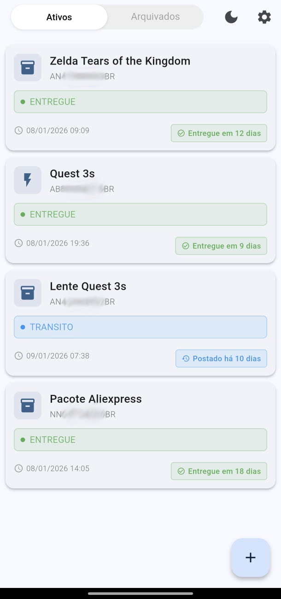
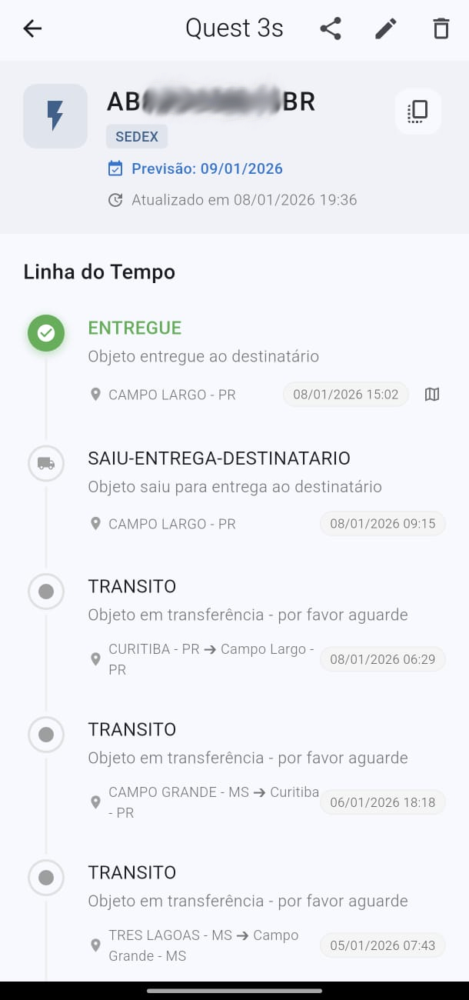
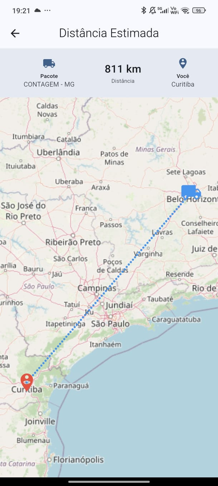

# RastreioDex

<div align="center">
  <h3>Rastreamento Inteligente de Encomendas Brasileiras</h3>
  <p>Aplicativo Flutter para rastreamento de pacotes dos Correios (SEDEX, PAC, encomendas internacionais)</p>
</div>

---

## Sobre o Projeto

RastreioDex é um aplicativo móvel desenvolvido em Flutter que permite rastrear encomendas brasileiras em tempo real utilizando a API da Wonca Labs. O app oferece uma experiência completa com notificações push, atualizações em segundo plano, widgets para a tela inicial do Android e visualização de distâncias em mapas.

## Funcionalidades

### 🔍 Rastreamento de Encomendas

**Rastreamento em Tempo Real**
- Acompanhe encomendas dos Correios usando códigos de rastreio brasileiros (formato: AA000000000BR)
- Suporta SEDEX, PAC, encomendas internacionais e mais de 150 tipos diferentes
- Detecção automática do tipo de encomenda baseado no prefixo do código
- Visualização completa do histórico de eventos com timeline interativa
- Previsão de entrega quando disponibilizada pelos Correios

**Smart Paste Inteligente**
- Detecção automática de códigos copiados na área de transferência
- Auto-preenchimento ao abrir a tela de adicionar encomenda
- Validação de formato antes de preencher
- Verificação de duplicatas (evita cadastrar o mesmo código duas vezes)
- Feedback háptico sutil ao detectar e colar

### 📦 Organização e Gerenciamento

**Sistema de Abas Duplas**
- **Ativos**: Encomendas em trânsito ou recém-entregues
- **Arquivados**: Encomendas entregues ou que você decidiu arquivar
- Alternância rápida entre abas com animação suave

**Gestão Completa**
- Adicione nomes personalizados (ex: "Presente da Mãe", "Teclado Novo")
- Reordene manualmente arrastando e soltando os cards
- Arquivamento automático de encomendas entregues após 7 dias
- Opção de ocultar encomendas já entregues da aba Ativos
- Edição rápida de informações

**Ações Rápidas por Gestos**
- **Deslize para esquerda**: Arquivar encomenda (fundo laranja)
- **Deslize para direita**: Deletar encomenda (fundo vermelho)
- Confirmação antes de deletar permanentemente
- Opção "Desfazer" ao arquivar via SnackBar

### 🔔 Notificações e Atualizações Automáticas

**Notificações Push Inteligentes**
- Alertas quando o status da encomenda mudar
- Exibe nome personalizado ou código de rastreio
- Mostra o novo status na notificação
- Notifica apenas mudanças reais (evita spam)

**Background Service**
- Verificação automática a cada 15 minutos usando Workmanager
- Atualiza apenas encomendas ativas (economia de bateria)
- Funciona mesmo com o app totalmente fechado
- Atualiza widget automaticamente se a encomenda fixada mudar

**Atualização Manual**
- Pull-to-refresh: puxe para baixo na lista
- Atualização individual na tela de detalhes
- Indicador visual com skeleton shimmer durante carregamento
- Retry automático (3 tentativas) em caso de falha

### 🏠 Widget para Tela Inicial (Android)

**Widget Nativo Inteligente**
- Fixe uma encomenda para acompanhar direto da home screen
- Exibe: nome personalizado, código, status e descrição
- Ícones coloridos por status:
  - 🟢 **Verde**: Entregue
  - 🔵 **Azul**: Em trânsito/transferência
  - 🟠 **Laranja**: Aguardando/outros
- Header automático (some quando nome = código)

**Interação por Clique**
- Toque no widget para abrir seletor de encomendas
- Lista apenas encomendas ativas
- Atualização instantânea após selecionar
- Feedback visual ao fixar nova encomenda

### 🗺️ Mapa e Visualização de Distância

**OpenStreetMap Integration**
- Veja no mapa a rota entre você e a encomenda
- Cálculo automático de distância em linha reta
- Linha pontilhada azul conectando os pontos
- Marcadores identificam sua localização e da encomenda
- Suporte a retina mode (telas de alta resolução)

**Configuração de Localização**
- Defina sua cidade nas configurações (ex: "Curitiba, PR")
- Geocoding gratuito via Nominatim API (sem chaves necessárias)
- Botão de mapa aparece apenas no evento mais recente
- Zoom automático para enquadrar ambos os pontos

### 🎨 Interface e Experiência do Usuário

**Sistema de Temas**
- Modo claro e escuro com alternância rápida no AppBar
- Persistência da preferência entre sessões
- Todos os componentes adaptam cores automaticamente
- Transições suaves entre temas

**Feedback Háptico Contextual**
- Vibrações diferentes para cada tipo de ação:
  - **Leve**: reordenar, Smart Paste, pull-to-refresh, toggle
  - **Médio**: arquivar, adicionar encomenda, fixar widget
  - **Pesado**: confirmar exclusão (ação destrutiva)
  - **Clique**: abrir diálogos, copiar código

**Estados de Loading**
- Skeleton loading com efeito shimmer realista
- Indicadores de progresso em operações assíncronas
- Pull-to-refresh com animação Material Design
- Feedback visual em todas as ações

### 💾 Privacidade e Dados

**Armazenamento Local Seguro**
- Todos os dados salvos em SQLite no dispositivo
- Nenhuma informação enviada para nuvem (exceto API de rastreio)
- Performance rápida com consultas otimizadas
- Privacidade total dos seus dados

**Sistema de Backup**
- Exporte todos os dados em formato JSON
- Restaure de backups anteriores com um toque
- Útil para trocar de aparelho ou reinstalar
- Backup manual sob seu controle

### 📱 Detalhes e Timeline

**Visualização Cronológica**
- Timeline completa de todos os eventos de rastreamento
- Data, hora e localização de cada atualização
- Status e descrição detalhada de cada ponto
- Indicador visual do evento mais recente
- Ícones diferenciados por tipo de evento

**Ações Disponíveis**
- Copiar código de rastreio com um toque
- Editar nome personalizado
- Ver localização no mapa (último ponto)
- Atualizar status via pull-to-refresh
- Compartilhar informações da encomenda

### ⚙️ Configurações Personalizáveis

- Configurar chave da API Wonca Labs
- Definir sua cidade para cálculo de distâncias
- Ativar/desativar Smart Paste automático
- Escolher se quer ocultar encomendas entregues
- Visualizar quantidade de encomendas cadastradas
- Acessar sistema de backup/restore
- Informações da versão do app

## Screenshots

<table>
  <tr>
    <td align="center">
      
      <br />
      <sub><b>Tela Principal</b></sub>
      <br />
      <sub>Sistema de abas com encomendas ativas e arquivadas</sub>
    </td>
    <td align="center">
      
      <br />
      <sub><b>Detalhes do Rastreio</b></sub>
      <br />
      <sub>Timeline completa com todos os eventos de rastreamento</sub>
    </td>
    <td align="center">
      
      <br />
      <sub><b>Mapa de Distância</b></sub>
      <br />
      <sub>Visualização com OpenStreetMap mostrando localização e distância</sub>
    </td>
  </tr>
</table>

## Pré-requisitos

- Flutter SDK 3.0 ou superior
- Android SDK (para build Android)
- Conta na [Wonca Labs](https://labs.wonca.com.br) para obter API key

## Instalação

### 1. Clone o Repositório
```bash
git clone https://github.com/seu-usuario/rastreiodex.git
cd rastreiodex
```

### 2. Instale as Dependências
```bash
flutter pub get
```

### 3. Execute o App
```bash
# Debug mode
flutter run

# Release mode
flutter run --release
```

### 4. Build APK
```bash
# Debug APK
flutter build apk

# Release APK
flutter build apk --release

# App Bundle (Play Store)
flutter build appbundle
```

## Configuração

### API Key da Wonca Labs

1. Acesse [labs.wonca.com.br](https://labs.wonca.com.br) e crie uma conta
2. Obtenha sua API key
3. No app, vá em **Configurações** > **Chave API**
4. Cole sua chave e salve

### Configurar Cidade (Opcional)

Para usar o recurso de mapa e cálculo de distância:

1. Vá em **Configurações** > **Localização**
2. Digite sua cidade e estado (ex: "Curitiba, PR")
3. Salve as configurações

## Tecnologias

### Flutter & Dart
- **adaptive_theme**: Sistema de temas claro/escuro
- **flutter_map**: Visualização de mapas OpenStreetMap
- **latlong2**: Cálculos geográficos e de distância

### Armazenamento
- **sqflite**: Banco de dados SQLite local
- **shared_preferences**: Preferências e configurações
- **path_provider**: Acesso a diretórios do sistema

### Background & Widgets
- **workmanager**: Tarefas em segundo plano
- **home_widget**: Widget Android para tela inicial

### Notificações
- **flutter_local_notifications**: Notificações push locais

### UI/UX
- **shimmer**: Efeito de loading skeleton
- **timeline_tile**: Timeline de eventos de rastreamento
- **screenshot**: Captura de tela para compartilhamento
- **share_plus**: Compartilhamento de imagens

### Network
- **http**: Requisições HTTP para API
- **connectivity_plus**: Verificação de conectividade

## Estrutura do Projeto

```
lib/
├── main.dart                      # Entry point
├── models/
│   ├── package.dart              # Model de encomenda
│   └── tracking_event.dart       # Model de evento de rastreamento
├── screens/
│   ├── home_screen.dart          # Tela principal (abas ativas/arquivadas)
│   ├── add_package_screen.dart   # Adicionar encomenda
│   ├── edit_package_screen.dart  # Editar encomenda
│   ├── package_details_screen.dart # Detalhes e timeline
│   ├── settings_screen.dart      # Configurações
│   └── map_screen.dart           # Mapa de distância
├── services/
│   ├── database_service.dart     # SQLite CRUD operations
│   ├── tracking_service.dart     # Wonca Labs API
│   ├── background_service.dart   # Workmanager tasks
│   ├── notification_service.dart # Push notifications
│   ├── preferences_service.dart  # SharedPreferences wrapper
│   └── widget_service.dart       # Android widget logic
└── widgets/
    ├── package_card.dart         # Card de encomenda
    └── skeleton_package_card.dart # Loading placeholder

android/
└── app/src/main/kotlin/com/agiomartinez/rastreiodex/
    └── TrackingWidgetProvider.kt # Widget Android nativo
```

## Arquitetura

### Fluxo de Dados

**TrackingService (API Layer)**
- Faz requisições à API da Wonca Labs
- Implementa retry logic (3 tentativas) e timeout de 30 segundos
- Classifica automaticamente tipos de encomenda por prefixo
- Retorna: `({List<TrackingEvent> events, DateTime? estimatedDelivery})`

**DatabaseService (Persistence Layer)**
- CRUD operations com SQLite
- Streams de pacotes filtrados por `isArchived`
- Ordenação por: `orderIndex` ASC, `addedAt` DESC
- Auto-arquivamento de entregues após 7 dias

**BackgroundService (Background Tasks)**
- Executa a cada 15 minutos via Workmanager
- Atualiza encomendas não-arquivadas
- Envia notificações apenas quando status muda
- Atualiza widget se o pacote fixado receber atualizações

**Package Model**
- Campos principais: `trackingCode`, `events`, `currentStatus`, `estimatedDelivery`
- Flags: `isArchived`, `isDelivered`
- Metadados: `orderIndex`, `addedAt`, `lastUpdate`

## Padrões de Feedback Háptico

O app usa diferentes padrões de vibração para comunicar ações:

- **selectionClick**: Interações simples (copiar, abrir diálogos)
- **lightImpact**: Mudanças sutis (Smart Paste, reordenar, toggle, refresh)
- **mediumImpact**: Conclusão de tarefas (arquivar, adicionar, fixar widget)
- **heavyImpact**: Ações destrutivas (confirmar exclusão)

## Desenvolvimento


### Convenções de Código

- Sempre usar `async/await` ao invés de `.then()`
- Verificar `mounted` antes de usar `BuildContext` após operações assíncronas
- Todas as estruturas de controle devem ter chaves `{}`
- Usar `withAlpha()` ao invés de `withValues(alpha:)`
- Preferir editar arquivos existentes ao invés de criar novos
