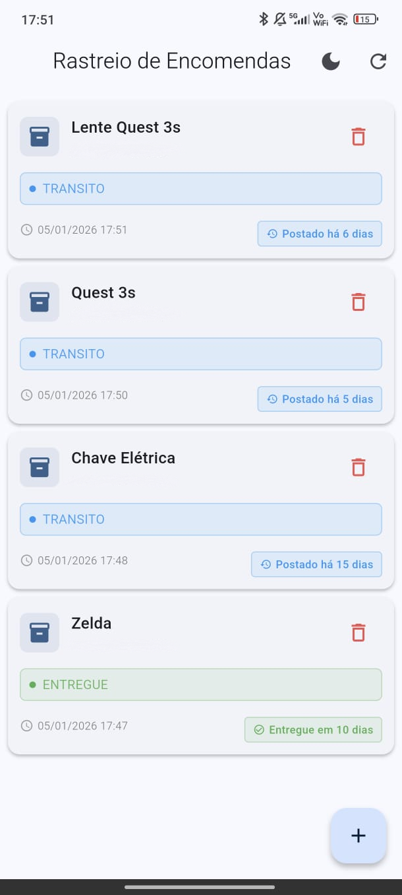

# RastreioDex

<p align="center">
  
</p>

<p align="center">
  <strong>Aplicativo de rastreamento de encomendas SEDEX e outros serviços postais brasileiros</strong>
</p>

## Sobre o Projeto

RastreioDex é um aplicativo móvel desenvolvido em Flutter que permite rastrear encomendas dos Correios de forma simples e eficiente. Com suporte a notificações automáticas e atualizações em segundo plano, você nunca mais perderá uma atualização importante sobre suas encomendas.

## Funcionalidades

- **Rastreamento em Tempo Real**: Acompanhe suas encomendas através da API Wonca Labs
- **Múltiplos Tipos de Encomenda**: Suporte para SEDEX, PAC, SEDEX Hoje, encomendas internacionais e mais
- **Notificações Push**: Receba alertas automáticos sobre mudanças no status das suas encomendas
- **Atualização Automática**: O app verifica atualizações em segundo plano
- **Nomes Personalizados**: Dê apelidos às suas encomendas para fácil identificação
- **Tema Adaptativo**: Interface com suporte a modo claro e escuro
- **Histórico Completo**: Visualize todo o histórico de movimentação de cada encomenda
- **Validação de Código**: Verifica automaticamente se o código de rastreamento é válido
- **Smart Paste**: Detecção automática de códigos de rastreamento na área de transferência
- **Sistema de Arquivamento**: Organize encomendas entregues em abas separadas
- **Swipe Actions**: Deslize para arquivar, desarquivar ou excluir encomendas
- **Reordenação**: Arraste e solte para reorganizar suas encomendas
- **Configurações Personalizáveis**: Ajuste frequência de atualização, API key e comportamento do app

## Tipos de Encomenda Suportados

O aplicativo identifica automaticamente o tipo de encomenda pelo código de rastreamento:

| Tipo de Serviço |
----------------|
| SEDEX |
| PAC |
| SEDEX Hoje |
| Registro |
| Internacional |

## Tecnologias Utilizadas

- **Flutter** - Framework multiplataforma
- **Firebase**
  - Cloud Firestore - Armazenamento de dados
  - Cloud Messaging - Notificações push
- **Workmanager** - Execução de tarefas em segundo plano
- **HTTP** - Requisições para API de rastreamento
- **Adaptive Theme** - Gerenciamento de temas claro/escuro
- **Flutter Local Notifications** - Notificações locais
- **Shared Preferences** - Armazenamento de configurações locais

## Estrutura do Projeto

```
lib/
├── main.dart                        # Ponto de entrada do aplicativo
├── models/                          # Modelos de dados
│   ├── package.dart                # Modelo de encomenda
│   └── tracking_event.dart         # Modelo de evento de rastreamento
├── screens/                         # Telas do aplicativo
│   ├── home_screen.dart            # Tela principal com abas (Ativos/Arquivados)
│   ├── add_package_screen.dart     # Tela para adicionar nova encomenda
│   ├── edit_package_screen.dart    # Tela para editar encomenda
│   ├── package_details_screen.dart # Detalhes e histórico da encomenda
│   ├── settings_screen.dart        # Tela de configurações do app
│   └── debug_screen.dart           # Tela de debug (desenvolvimento)
├── services/                        # Serviços e lógica de negócio
│   ├── tracking_service.dart       # Integração com API de rastreamento
│   ├── firebase_service.dart       # Gerenciamento do Firebase
│   ├── notification_service.dart   # Gerenciamento de notificações
│   ├── background_service.dart     # Tarefas em segundo plano
│   ├── preferences_service.dart    # Gerenciamento de configurações locais
│   └── theme_service.dart          # Configuração de temas
└── widgets/                         # Componentes reutilizáveis
    └── package_card.dart           # Card de encomenda
```

## Requisitos

- Flutter SDK 3.8.0 ou superior
- Dart SDK 3.8.0 ou superior
- Android Studio / Xcode (para desenvolvimento)
- Conta Firebase configurada

## Instalação

1. Clone o repositório:
```bash
git clone https://github.com/seu-usuario/rastreiodex.git
cd rastreiodex
```

2. Instale as dependências:
```bash
flutter pub get
```

3. Configure o Firebase:
   - Crie um projeto no [Firebase Console](https://console.firebase.google.com/)
   - Adicione um aplicativo Android
   - Baixe o arquivo `google-services.json` e coloque em `android/app/`
   - Habilite Cloud Firestore e Cloud Messaging no console

4. Execute o aplicativo:
```bash
flutter run
```

## Configuração do Firebase

O aplicativo utiliza os seguintes serviços do Firebase:

1. **Cloud Firestore**: Para armazenar e sincronizar dados das encomendas
2. **Cloud Messaging**: Para enviar notificações push sobre atualizações

Certifique-se de habilitar esses serviços no console do Firebase.

## Como Usar

1. **Adicionar Encomenda**:
   - Toque no botão "+" na tela principal
   - Insira o código de rastreamento (formato: XX000000000XX)
   - Opcionalmente, adicione um nome personalizado
   - Toque em "Adicionar"

2. **Visualizar Detalhes**:
   - Toque em qualquer encomenda da lista
   - Veja o histórico completo de movimentação
   - Informações são ordenadas da mais recente para a mais antiga

3. **Editar Encomenda**:
   - Acesse os detalhes da encomenda
   - Toque no ícone de edição
   - Altere o nome personalizado conforme necessário

4. **Excluir Encomenda**:
   - Acesse os detalhes da encomenda
   - Toque no ícone de lixeira
   - Confirme a exclusão

5. **Alternar Tema**:
   - Toque no ícone de tema na tela principal
   - Escolha entre modo claro, escuro ou automático

## API de Rastreamento

O aplicativo utiliza a [Wonca Labs API](https://api-labs.wonca.com.br/) para obter informações de rastreamento dos Correios. A API fornece:

- Status atual da encomenda
- Histórico completo de movimentação
- Localização de cada evento
- Data e hora de cada atualização

## Funcionalidades em Segundo Plano

O RastreioDex verifica automaticamente atualizações das suas encomendas a cada 15 minutos, mesmo quando o app está fechado. Quando há uma mudança de status, você recebe uma notificação instantânea.

## Contribuindo

Contribuições são bem-vindas! Sinta-se à vontade para:

1. Fazer um fork do projeto
2. Criar uma branch para sua feature (`git checkout -b feature/NovaFuncionalidade`)
3. Commit suas mudanças (`git commit -m 'Adiciona nova funcionalidade'`)
4. Push para a branch (`git push origin feature/NovaFuncionalidade`)
5. Abrir um Pull Request

## Licença

Este projeto é de código aberto e está disponível para uso pessoal e educacional.

## Contato

Para dúvidas, sugestões ou reportar problemas, abra uma issue neste repositório.

---

Desenvolvido com Flutter
